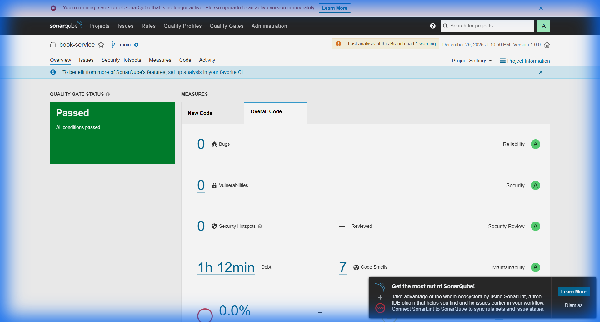
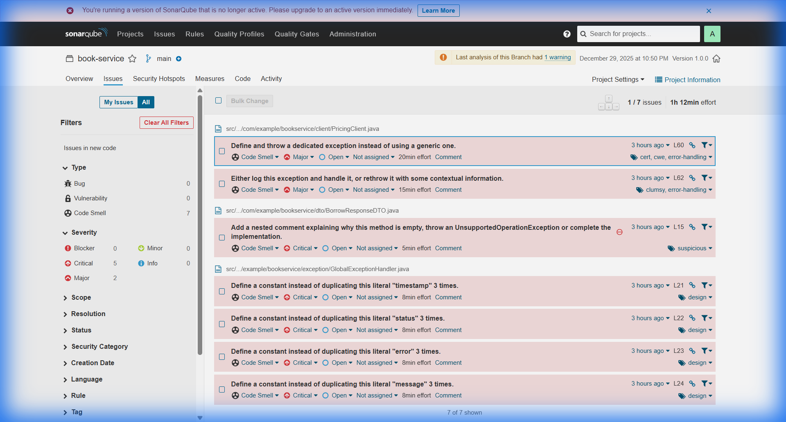

# 🔬 TP28 - Analyse de Qualité de Code avec SonarQube

<div align="center">


**Réalisé par : Karzouz Saad**

*Mise en place d'une analyse de qualité de code avec SonarQube en local via Docker*

</div>

---

## 📋 Table des Matières

- [🎯 Objectif](#-objectif)
- [🏗️ Architecture](#️-architecture)
- [🚀 Étapes de Réalisation](#-étapes-de-réalisation)
  - [Étape 1 - Démarrage de SonarQube](#étape-1---démarrage-de-sonarqube-via-docker)
  - [Étape 2 - Création du Projet](#étape-2---création-du-projet-dans-sonarqube)
  - [Étape 3 - Génération du Token](#étape-3---génération-du-token)
  - [Étape 4 - Analyse Maven](#étape-4---analyse-maven)
  - [Étape 5 - Interprétation des Résultats](#étape-5---interprétation-des-résultats)
- [📊 Comprendre le Quality Gate](#-comprendre-le-quality-gate)
- [🔧 Dépannage](#-dépannage)
- [📚 Ressources](#-ressources)

---

## 🎯 Objectif

L'objectif de ce TP est de :

1. **Mettre en place SonarQube** en local via Docker
2. **Créer un projet** et générer un token d'authentification
3. **Lancer une analyse** sur un projet Java Maven
4. **Interpréter les résultats** : Quality Gate, bugs, code smells, vulnérabilités, couverture...

---

## 🏗️ Architecture

```
┌─────────────────────────────────────────────────────────────────────┐
│                          POSTE DÉVELOPPEUR                          │
├─────────────────────────────────────────────────────────────────────┤
│                                                                     │
│  ┌─────────────────────────────────────────────────────────────┐   │
│  │                    Docker Desktop                            │   │
│  │  ┌─────────────────────────────────────────────────────┐    │   │
│  │  │              SonarQube (port 9000)                   │    │   │
│  │  │  ┌───────────────────────────────────────────────┐  │    │   │
│  │  │  │              Dashboard Web                     │  │    │   │
│  │  │  │  • Quality Gate                               │  │    │   │
│  │  │  │  • Issues (Bugs, Code Smells, Vulnérabilités) │  │    │   │
│  │  │  │  • Security Hotspots                          │  │    │   │
│  │  │  │  • Measures (Coverage, Duplications...)       │  │    │   │
│  │  │  └───────────────────────────────────────────────┘  │    │   │
│  │  │                                                      │    │   │
│  │  │  Volumes Docker:                                     │    │   │
│  │  │  • sonarqube_data (données)                         │    │   │
│  │  │  • sonarqube_logs (logs)                            │    │   │
│  │  │  • sonarqube_extensions (plugins)                   │    │   │
│  │  └─────────────────────────────────────────────────────┘    │   │
│  └─────────────────────────────────────────────────────────────┘   │
│                                                                     │
│  ┌─────────────────────────────────────────────────────────────┐   │
│  │                    Projet Maven                              │   │
│  │  ┌─────────────────┐     ┌────────────────────────────┐     │   │
│  │  │   pom.xml       │     │   mvn clean verify sonar:  │     │   │
│  │  │                 │ ──► │   sonar                     │     │   │
│  │  │   (book-service)│     │   -Dsonar.projectKey=...   │     │   │
│  │  └─────────────────┘     │   -Dsonar.login=TOKEN      │     │   │
│  │                          └───────────────┬────────────┘     │   │
│  └──────────────────────────────────────────│──────────────────┘   │
│                                              │                      │
│                                              ▼                      │
│                                   ┌─────────────────┐              │
│                                   │  Rapport JSON   │              │
│                                   │  (envoyé à      │              │
│                                   │   SonarQube)    │              │
│                                   └─────────────────┘              │
└─────────────────────────────────────────────────────────────────────┘
```

---

## 🚀 Étapes de Réalisation

### Étape 1 - Démarrage de SonarQube via Docker

#### 1.1 Créer les volumes Docker (persistance)

Ces volumes gardent les données SonarQube entre les redémarrages.

```bash
docker volume create sonarqube_data
docker volume create sonarqube_logs
docker volume create sonarqube_extensions
```

> 💡 **Note** : Sans volumes, tout est perdu quand le conteneur est supprimé (projets, règles, historiques...).

#### 1.2 Lancer SonarQube

```bash
docker run -d --name sonarqube -p 9000:9000 \
  -v sonarqube_data:/opt/sonarqube/data \
  -v sonarqube_logs:/opt/sonarqube/logs \
  -v sonarqube_extensions:/opt/sonarqube/extensions \
  sonarqube:lts-community
```

**Commande PowerShell (Windows) :**
```powershell
docker run -d --name sonarqube -p 9000:9000 `
  -v sonarqube_data:/opt/sonarqube/data `
  -v sonarqube_logs:/opt/sonarqube/logs `
  -v sonarqube_extensions:/opt/sonarqube/extensions `
  sonarqube:lts-community
```

#### 1.3 Vérifier l'accès web

Ouvrir : **http://localhost:9000**

- **Identifiants par défaut** : `admin` / `admin`
- SonarQube demande ensuite de changer le mot de passe

---

### Étape 2 - Création du Projet dans SonarQube

#### 2.1 Accéder à "Projects"

Aller dans la barre du haut → **Projects**

#### 2.2 Cliquer sur "Create Project"

En haut à droite, cliquer sur **Create Project**

#### 2.3 Choisir "Manually"

Puisque le code est sur la machine locale (pas sur GitHub/GitLab intégré), choisir **Manually**.

#### 2.4 Renseigner les informations du projet

| Champ | Valeur |
|-------|--------|
| **Project display name** | `Book_Service_TP28` |
| **Project key** | `Book_Service_TP28` |

> 💡 **Note** : La `project key` est utilisée par la commande Maven (`-Dsonar.projectKey=...`)

---

### Étape 3 - Génération du Token

Le token sert d'authentification pour autoriser l'analyse.

#### 3.1 Choisir "Locally"

Après création, SonarQube demande comment analyser le dépôt. Choisir **Locally**.

#### 3.2 Générer un token

| Paramètre | Valeur |
|-----------|--------|
| **Token name** | `Analyze_Book_Service_TP28` |
| **Expiration** | `30 days` |

Cliquer sur **Generate**.

#### 3.3 Sauvegarder le token

⚠️ **IMPORTANT** : Copier et garder le token en lieu sûr. Ne jamais le publier ou le commiter !

---

### Étape 4 - Analyse Maven

#### 4.1 Se placer dans le dossier du projet

```bash
cd book-service
```

#### 4.2 Lancer l'analyse

**Linux/Mac (bash/zsh) :**
```bash
mvn clean verify sonar:sonar \
  -Dsonar.projectKey=Book_Service_TP28 \
  -Dsonar.host.url=http://localhost:9000 \
  -Dsonar.login=VOTRE_TOKEN
```

**Windows (PowerShell) :**
```powershell
mvn clean verify sonar:sonar `
  -Dsonar.projectKey=Book_Service_TP28 `
  -Dsonar.host.url=http://localhost:9000 `
  -Dsonar.login=VOTRE_TOKEN
```

#### 4.3 Résultat attendu

```
[INFO] ANALYSIS SUCCESSFUL, you can browse http://localhost:9000/dashboard?id=Book_Service_TP28
[INFO] Note that you will be able to access the updated dashboard once the server has processed the submitted analysis report
[INFO] More about the report processing at http://localhost:9000/api/ce/task?id=...
[INFO] BUILD SUCCESS
```

---

### Étape 5 - Interprétation des Résultats

#### 5.1 Accéder au Dashboard

Dans SonarQube : **Projects** → sélectionner **Book_Service_TP28**

#### 5.2 Sections principales

| Section | Description |
|---------|-------------|
| **Overview** | Résumé + Quality Gate |
| **Issues** | Liste détaillée (Bugs, Code Smells, Vulnerabilities) |
| **Security Hotspots** | Points à valider (revue sécurité) |
| **Measures** | Métriques (duplication, complexité, coverage...) |
| **Code** | Code annoté + explications règle par règle |
| **Activity** | Historique des analyses |

---

## 📊 Comprendre le Quality Gate

Le **Quality Gate** indique si le projet respecte les critères minimaux de qualité.

### Quality Gate - PASSED ✅

Toutes les conditions sont satisfaites :
- Aucun nouveau bug critique
- Couverture suffisante
- Duplications acceptables
- Sécurité validée

### Quality Gate - FAILED ❌

Une ou plusieurs conditions ne sont pas respectées :
- Trop de bugs
- Couverture trop faible
- Vulnérabilités détectées
- Trop de duplications

### Ordre de priorité pour les corrections

1. 🐛 **Bugs** - Erreurs qui peuvent causer des comportements inattendus
2. 🔐 **Vulnerabilities / Hotspots** - Problèmes de sécurité
3. 💨 **Code Smells** - Mauvaises pratiques (maintenabilité)
4. 📊 **Coverage** - Ajout de tests unitaires

---

## 🔧 Dépannage

| Erreur | Solution |
|--------|----------|
| **401 / Unauthorized** | Token invalide → régénérer et relancer |
| **Connection refused** | SonarQube non démarré / mauvaise URL |
| **Projet introuvable** | `sonar.projectKey` différent de celui créé dans SonarQube |
| **Analyse très lente** | Machine chargée / SonarQube pas encore "Ready" |
| **Port 9000 occupé** | Utiliser `-p 9001:9000` puis `http://localhost:9001` |

### Vérifier le statut de SonarQube

```bash
docker logs sonarqube
```

### Redémarrer SonarQube

```bash
docker restart sonarqube
```

---

## 📚 Ressources

- 📖 [Documentation SonarQube](https://docs.sonarqube.org/latest/)
- 🐳 [SonarQube sur Docker Hub](https://hub.docker.com/_/sonarqube)
- 📊 [Guide Quality Gates](https://docs.sonarqube.org/latest/user-guide/quality-gates/)
- 🔧 [Maven SonarScanner](https://docs.sonarqube.org/latest/analyzing-source-code/scanners/sonarscanner-for-maven/)

---

## 📈 Résultats de l'Analyse (Book_Service_TP28)

### Dashboard Overview



### 🎯 Quality Gate : ✅ **PASSED**

L'analyse du projet `book-service` a été réalisée avec succès. Voici les résultats :

| Métrique | Valeur | Note |
|----------|--------|------|
| **Quality Gate** | ✅ PASSED | Toutes les conditions satisfaites |
| **Bugs** | 0 | **A** |
| **Vulnérabilités** | 0 | **A** |
| **Security Hotspots** | 0 | **A** |
| **Code Smells** | 7 | **A** |
| **Dette Technique** | 1h 12min | **A** |
| **Couverture** | 0.0% | 176 lignes à couvrir |
| **Duplications** | 5.3% | 2 blocs dupliqués |

### 📋 Liste des Code Smells Détectés



| Fichier | Ligne | Sévérité | Description | Effort |
|---------|-------|----------|-------------|--------|
| **PricingClient.java** | 60 | 🟠 Major | Exception générique au lieu d'une dédiée | 20min |
| **PricingClient.java** | 62 | 🟠 Major | Exception non logguée ni transmise | 15min |
| **BorrowResponseDTO.java** | 15 | 🔴 Critical | Méthode vide sans commentaire | 5min |
| **GlobalExceptionHandler.java** | 21 | 🔴 Critical | Littéral "timestamp" dupliqué 3x | 8min |
| **GlobalExceptionHandler.java** | 22 | 🔴 Critical | Littéral "status" dupliqué 3x | 8min |
| **GlobalExceptionHandler.java** | 23 | 🔴 Critical | Littéral "error" dupliqué 3x | 8min |
| **GlobalExceptionHandler.java** | 24 | 🔴 Critical | Littéral "message" dupliqué 3x | 8min |

### 🔧 Actions Recommandées

1. **Priorité Haute** : Définir des constantes pour les littéraux dupliqués dans `GlobalExceptionHandler.java`
2. **Priorité Moyenne** : Améliorer la gestion des exceptions dans `PricingClient.java`
3. **Priorité Basse** : Ajouter un commentaire explicatif ou implémenter la méthode vide dans `BorrowResponseDTO.java`
4. **Amélioration Continue** : Ajouter des tests unitaires pour augmenter la couverture de code

---

## 📝 Mini-Récap

- ✅ SonarQube tourne en local via Docker sur `localhost:9000`
- ✅ Projet créé en mode **Manually**
- ✅ Token généré et utilisé dans Maven
- ✅ Analyse déclenchée via `mvn clean verify sonar:sonar`
- ✅ Lecture du Quality Gate et des issues (priorité : bugs + sécurité)

---

## 📁 Structure du Projet

```
tp28/
├── 📄 README.md                    # Ce fichier
├── 📁 Screenshots/                 # Captures d'écran du TP
│   ├── sonarqube_overview.png
│   ├── quality_gate_passed.png
│   ├── issues_list.png
│   └── ...
└── 📁 book-service/                # Projet Maven analysé
    ├── 📄 pom.xml
    └── 📁 src/
        ├── 📁 main/
        │   └── 📁 java/
        │       └── 📁 com/example/bookservice/
        │           ├── 📄 BookServiceApplication.java
        │           ├── 📁 controller/
        │           ├── 📁 service/
        │           ├── 📁 repository/
        │           ├── 📁 entity/
        │           ├── 📁 dto/
        │           ├── 📁 exception/
        │           └── 📁 config/
        └── 📁 test/
```

---

<div align="center">

**🔬 TP28 - SonarQube Analysis**

*Réalisé par Karzouz Saad*

</div>
